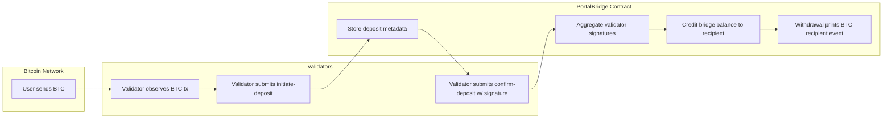

# PortalBridge Protocol

**Revolutionary Cross-Chain Infrastructure for Bitcoin ↔ Stacks Ecosystem**

---

## Overview

**PortalBridge Protocol** is a decentralized, trustless bridge designed to enable seamless asset transfers between the Bitcoin base layer and Stacks Layer 2.
It uses multi-validator consensus, cryptographic proof validation, and automated settlement to ensure security, transparency, and efficiency.

Key Features:

* **Cross-Chain Transfers** — Securely bridge BTC into Stacks Layer 2.
* **Multi-Validator Model** — Decentralized validator network confirms deposits.
* **Dynamic Risk Controls** — Emergency pause/resume, asset recovery, configurable limits.
* **Auditable Trails** — Every action logged on-chain for transparency.

---

## System Overview

| Component                    | Purpose                                                                |
| ---------------------------- | ---------------------------------------------------------------------- |
| **Deposits Map**             | Stores validated BTC transaction metadata (amount, sender, recipient). |
| **Validators Map**           | Tracks authorized validators who can confirm deposits.                 |
| **Validator Signatures Map** | Records validator signatures for multi-sig verification.               |
| **Bridge Balances**          | Tracks bridged token balances on Stacks for each user.                 |
| **Global State**             | Maintains bridge operational status, total bridged amount, etc.        |

**Operational Flow:**

1. **Deposit Initiation** — Validators submit verified BTC tx data to the contract.
2. **Deposit Confirmation** — Multiple validators confirm deposit signatures; assets minted on Stacks.
3. **Withdrawal** — Users withdraw bridged assets back to Bitcoin, triggering off-chain settlement.
4. **Admin Controls** — Contract deployer can pause, resume, or recover assets in emergencies.

---

## Contract Architecture

The PortalBridge Protocol Clarity contract consists of five core layers:

### 1. **Traits**

Defines the `bridgeable-token-trait` for cross-contract compatibility (transfer, balance).

### 2. **Constants**

* **Error Codes:** Standardized error constants for predictable error handling.
* **Protocol Constants:** Min/Max deposit limits, confirmations required, deployer principal.

### 3. **State Variables & Maps**

* `bridge-paused`: Global bridge status.
* `deposits`: Deposit records keyed by Bitcoin tx-hash.
* `validators`: Authorized validator principals.
* `validator-signatures`: Validator confirmations for each tx-hash.
* `bridge-balances`: User balances on Stacks.

### 4. **Public Functions**

| Function                             | Description                                              |
| ------------------------------------ | -------------------------------------------------------- |
| `initialize-bridge`                  | Activates the bridge (deployer only).                    |
| `pause-bridge` / `resume-bridge`     | Emergency controls.                                      |
| `add-validator` / `remove-validator` | Manage validator set (deployer only).                    |
| `initiate-deposit`                   | Records BTC deposit after validator verification.        |
| `confirm-deposit`                    | Confirms deposit and credits user bridge balance.        |
| `withdraw`                           | Allows user to withdraw from Stacks back to BTC address. |
| `emergency-withdraw`                 | Protocol-level asset recovery (deployer only).           |

### 5. **Read-Only / Validation Helpers**

* **Getters**: `get-deposit`, `get-bridge-status`, `get-validator-status`, `get-bridge-balance`.
* **Validators**: `is-valid-principal`, `is-valid-btc-address`, `is-valid-tx-hash`, `is-valid-signature`, `validate-deposit-amount`.

---

## Data Flow



**Explanation:**

* User sends BTC to the bridge address.
* Validators monitor the Bitcoin network and submit verified transactions.
* Deposit records + validator signatures trigger balance crediting.
* Withdrawals print an event log for off-chain BTC transfer fulfillment.

---

## Security Model

* **Multi-Validator Confirmation:** Mitigates single point of failure risk.
* **Deposit Range Enforcement:** Prevents abnormal deposits from affecting liquidity.
* **Emergency Controls:** Deployer can pause/resume or recover assets in critical scenarios.
* **Immutable Audit Trails:** Every deposit, confirmation, and withdrawal is logged on-chain.

---

## Deployment & Integration

### Prerequisites

* Clarity smart contract deployed on Stacks.
* Validators whitelisted by contract deployer.
* External monitoring system for Bitcoin transactions.

### Steps

1. Deploy the PortalBridge Clarity contract.
2. Run `initialize-bridge`.
3. Add validator principals using `add-validator`.
4. Validators submit deposits via `initiate-deposit`.
5. Confirm deposits via `confirm-deposit`.
6. Users query balances via `get-bridge-balance` and withdraw with `withdraw`.

---

## Example Usage

```clarity
;; Initialize the bridge (contract deployer only)
(contract-call? .portal-bridge initialize-bridge)

;; Add a validator
(contract-call? .portal-bridge add-validator 'SP123...ABC)

;; User checks balance
(contract-call? .portal-bridge get-bridge-balance 'SPUSER...XYZ)
```

---

## Future Enhancements

* **Automated Off-Chain Relayer:** Trigger Bitcoin withdrawals automatically.
* **DAO-Managed Validators:** Fully decentralized validator governance.
* **Support for Multiple Assets:** Extend `bridgeable-token-trait` to non-BTC assets.

---

## License

This project is open-sourced under the **MIT License**.
